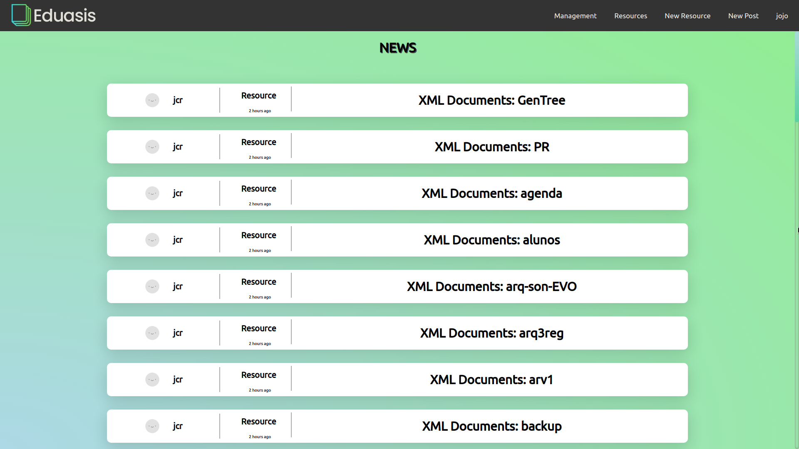

# Eduasis

A project dedicated for Web App Dev 

A Educational platform to share serveral types of arquives such as books, essays, appointments, projects, etc... Users can get content or be a producer of content. Administrators approve content submited by the producers.



This platform will be a web application server made in `javascript` with `mongodb`.

**Requires**
- `mongodb`
- `npm`
- `nodejs`

___
## API Server

### Installation

1. Install node dependencies
```shell
cd api_server
npm install
```

## Running

```shell
node bin/www
```

___
## App Server

### Installation

1. Install node dependencies
```shell
cd app_server
npm install
```

## Running

```shell
node bin/www
```